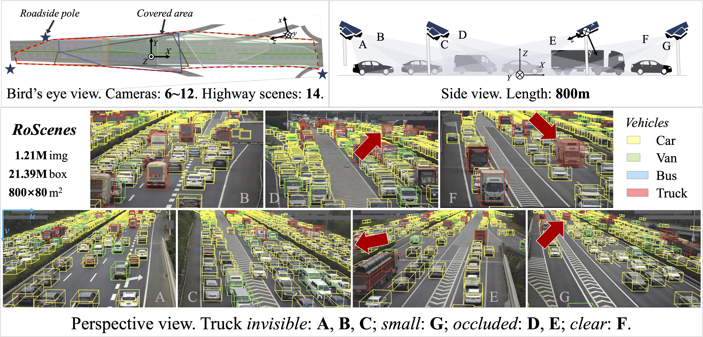

<p align="center">
  <a href="https://github.com/xiaosu-zhu/RoScenes#gh-light-mode-only" width="15%">
  
  </a>
  
  <a href="https://github.com/xiaosu-zhu/RoScenes#gh-dark-mode-only" width="15%">
  
  </a>
</p>

<p align="center" width="15%">
  <a href="https://arxiv.org/abs/2405.09883" target="_blank" width="15%">
    
  </a>
  
  <a href="https://github.com/xiaosu-zhu/RoScenes/stargazers" target="_blank" width="15%">
    
  </a>
  
  <a href="https://github.com/xiaosu-zhu/RoScenes/network/members" target="_blank" width="15%">
    
  </a>
  
  <a href="https://github.com/xiaosu-zhu/RoScenes/blob/main/LICENSE" target="_blank" width="15%">
    
  </a>
</p>

<br/>
<br/>

## 📰 Release Note

**[2024-05-28]** Please stay tuned for the updates! We are doing final checks on data privacy.

## 🏙️ Features


<p align="center">
  <a href="https://github.com/xiaosu-zhu/RoScenes#-features" width="15%">
  
  </a>
</p>

<!--
<p align="center">
    
    
    <span><b>Figure 1. Operational diagrams of different methods.</b></span>
</p> -->

## 🔖 Table of Contents
* [🔥 Quick Start](#-quick-start)
   * [Download](#download)
   * [PyPI](#pypi)
   * [Install Manually (for dev)](#install-manually-for-dev)
* [🔎 Explore the Dataset](#-explore-the-dataset)
* [👩‍💻 Examples](#-examples)
* [🎯 To-do List](#-to-do-list)


## 🔥 Quick Start

### Download
***Please stay tuned!***

### PyPI
To install RoScenes devkit, please follow the instructions.

```python
pip install roscenes

import roscenes as ro
```


### Install Manually (for dev)
You can clone this repository and install roscenes manually for developing.

```bash
git clone https://github.com/RoScenes.git

cd RoScenes

pip install -e .
```

## 🔎 Explore the Dataset

* Visualize the dataset
```bash
roscenes vis [DATASET_ROOT_FOLDER]
```

## 👩‍💻 Examples


## 🎯 To-do List
- [ ] Devkit release
- [ ] Dataset release
- [ ] Example dataset loader based on [`MMDetection3D`](https://github.com/open-mmlab/mmdetection3d)
- [ ] 3D detection task and evaluation suite
- [ ] 3D tracking task and evaluation suite

<br/>
<br/>
<p align="center">
<b>
This repo is licensed under
</b>
</p>
<p align="center">
<a href="https://www.apache.org/licenses/LICENSE-2.0" target="_blank">
  
</a>
</p>
<p align="center">
<a href="https://raw.githubusercontent.com/xiaosu-zhu/RoScenes/main/LICENSE">
  <b>Apache License<br/>Version 2.0</b>
</a>
</p>
